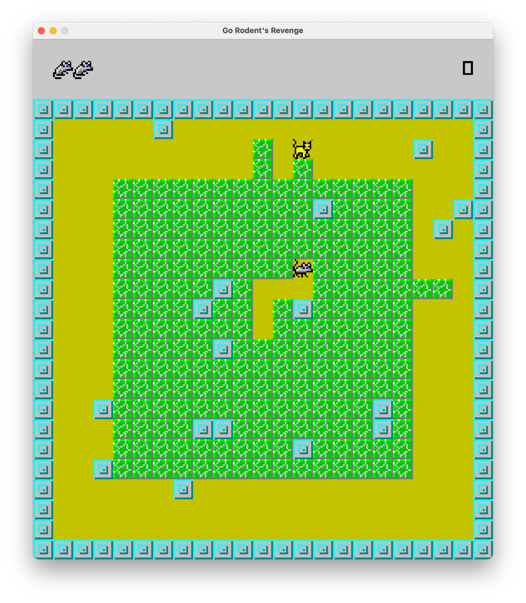

# Go, Rodent's Revenge!
This is a simple clone of the classic game [Rodent's Revenge](https://en.wikipedia.org/wiki/Rodent%27s_Revenge), where you play as a mouse trying to trap cats in a maze.
The game is written in Go and uses [raylib](https://github.com/gen2brain/raylib-go).

Obviously <u>**I do not own the rights to the original game**</u>, but I wanted to try and recreate it in Go as a fun project.



## Compile and run the game
1. Make sure you have Go installed on your machine. You can download it from [here](https://golang.org/dl/).
2. Compile the assets into a `C` header file.
   ```bash
   rm -rf assets.h && for i in assets/*.png; do xxd -i $i >> assets.h; done
   ```
3. Run `go build && ./go-rodents-revenge`

## Controls
- _Arrow keys_: Move the rodent (8 directions)
- `P`: Pause the game
- `Right Shift + UP`: Increase difficulty (speeds up the cats)
- `Right Shift + DOWN`: Decrease difficulty (speeds up the cats)
- `Right Shift + RIGHT`: Skip to the next level
- `Right Shift + LEFT`: Go back to the previous level
- `?`: Show the help screen

## What's next
- [x] Include assets as part of the game binary
- [ ] Implement balls of purple yarn
- [ ] Add a pattern (or randomness?) to the respawning of the cats. The original game seems to be using the pattern 1->2->2->1
- [x] Add an intro/help screen to display the instructions and the controls
- [ ] Add remaining levels of the game
- [ ] Add time to the top bar
