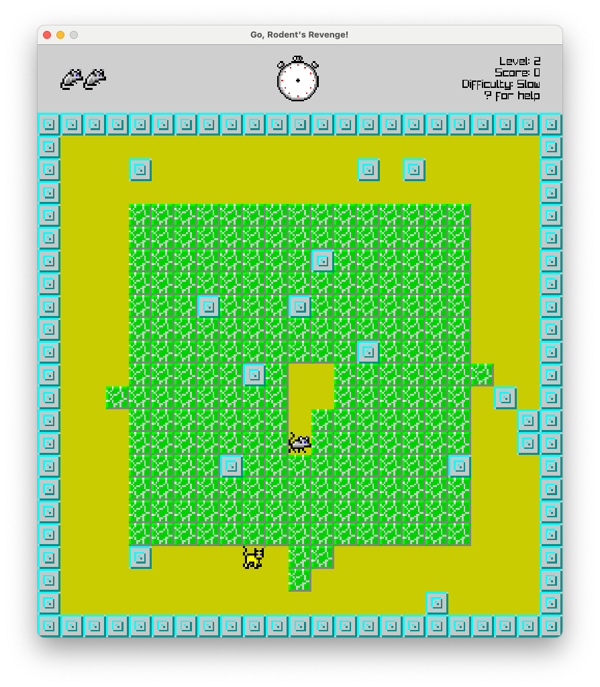

# Go, Rodent's Revenge!
This is a simple clone of the classic game [Rodent's Revenge](https://en.wikipedia.org/wiki/Rodent%27s_Revenge), where you play as a mouse trying to trap cats in a maze.
The game is written in Go and uses [raylib](https://github.com/gen2brain/raylib-go).

Obviously <u>**I do not own the rights to the original game**</u>, but I wanted to try and recreate it in Go as a fun project.

# What's next
- [ ] Include assets as part of the game binary
- [ ] Implement balls of purple yarn
- [ ] Add a pattern (or randomness?) to the respawning of the cats. The original game seems to be using the pattern 1->2->2->1
- [ ] Add an intro/help screen to display the instructions and the controls
- [ ] Add remaining levels of the game
- [ ] Add time to the top bar
